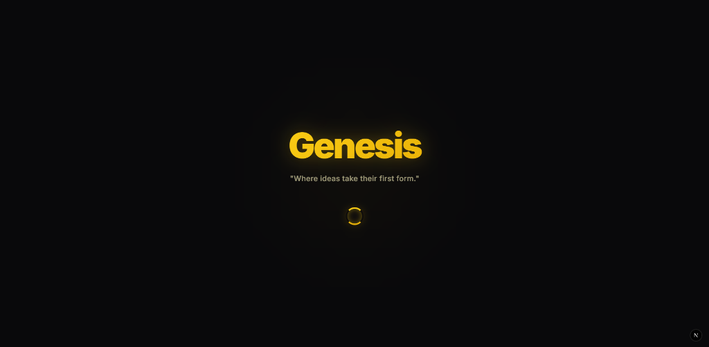
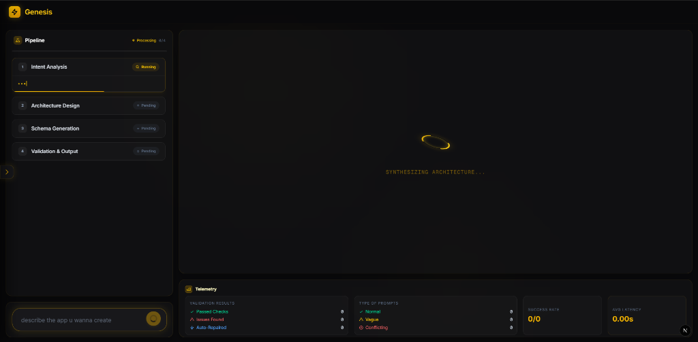
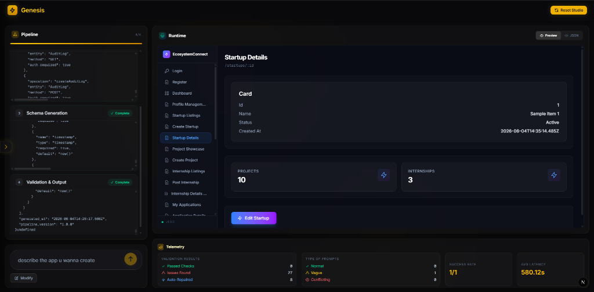
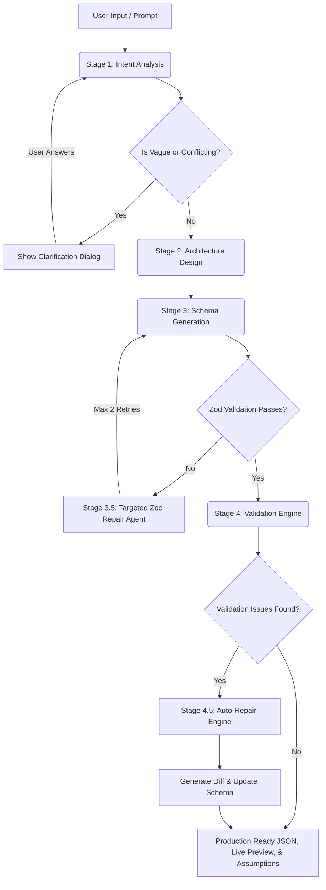

# Genesis — AI App Generator Studio

Genesis is a premium, AI-driven application generator studio built on **Next.js** and powered by the **Google Gemini API**. It processes natural language app descriptions through an advanced 4-stage streaming pipeline to produce a production-ready application schema.

It features intent analysis, automated system design, structured validation, and a self-healing schema repair loop.

---

## Interface Tour

Here is a look at the Genesis Studio experience:

### 1. Dynamic Splash Screen


### 2. Architecture Synthesis & Pipeline Progress


### 3. Application Runtime & Studio Dashboard


---

## Generation Pipeline

Below is the workflow showing the multi-stage streaming process, the self-healing loops, and user interaction checkpoints:



---

## Key Features

### 1. Multi-Stage Streaming Pipeline
* **Stage 1: Intent Analysis**: Deconstructs user input to identify requirements, core objectives, ambiguities, and potential conflicts.
* **Stage 2: Architecture Design**: Models the underlying data schema, access controls, roles, and route configurations.
* **Stage 3: Schema Generation**: Automatically translates architecture designs into structured JSON app configurations.
* **Stage 4: Validation & Repair**: Runs cross-layer sanity checks and automatically repairs inconsistencies.

### 2. Self-Healing Targeted Zod Repair Agent
* If the schema generated in Stage 3 fails Zod schema validations or is malformed JSON, a dedicated **Targeted Zod Repair Agent** takes only the error issues and the broken JSON payload to repair it.
* Features a built-in retry policy (up to 2 repair attempts) instead of restarting the entire pipeline from scratch, saving time, compute cycles, and API tokens.

### 3. Interactive Intent Clarification & Resume
* If a prompt is detected as highly vague or conflicting, Genesis halts execution and prompts the user with tailored clarification questions.
* Once the user inputs clarification answers, the pipeline resumes dynamically from Stage 1 without resetting the current visual progress.

### 4. Transparent AI Assumptions Auditing
* To bridge requirements gaps in brief prompts, the generation engine makes logical assumptions (e.g. default columns, page requirements) and documents them in the schema's `assumptions` array (`{ field, assumed, reason }`).
* Users can view these decisions at any time via the **Assumptions** button in the navbar. A glassmorphic popup displays what was assumed and why, ensuring that the AI's architecture design is transparent and auditable.

---

## Validation Engine & Auto-Repair

Genesis features a custom **Validation Engine** that performs deep, cross-layer semantic verification of the generated schema before it is mounted to the live preview. It runs 18 rules across 4 primary check categories:

1. **Role Enforcement (`MISSING_ROLE`)**: Verifies that every access permission role declared in page layouts or API configurations is explicitly defined in `auth.roles`.
2. **Component Mapping (`FIELD_MISMATCH`)**: Compares UI components (like Forms) with their corresponding API targets. It uses **Levenshtein Distance fuzzy-matching** to check that every form field maps to a valid column in the database, automatically suggesting corrections (e.g., matching `userEmail` to `user_email`).
3. **Table Integrity (`INVALID_TABLE_REF`)**: Inspects every API route to guarantee the referenced databases and tables exist within the schema.
4. **Endpoint Pruning (`ORPHAN_API`)**: Flags orphaned API routes that are never referenced by component actions, button forms, or data tables.

### The Auto-Repair workflow:
If any validations fail, Genesis redirects the schema into an **Auto-Repair Engine**. The engine performs corrections (e.g., adding missing roles to the authentication database, rewriting mismatched field names, or removing orphaned endpoints), generates a visual JSON structural diff, and renders a detailed repair log directly on the Studio Telemetry dashboard.

---

## Tech Stack

* **Framework**: Next.js (App Router)
* **Language**: TypeScript
* **Styling**: Tailwind CSS
* **Validation**: Zod (cross-layer schema verification)
* **LLM Engine**: Google GenAI SDK (`@google/genai`)

---

## Getting Started

### 1. Prerequisites
Ensure you have Node.js (v18+) and npm installed.

### 2. Environment Setup
Create a `.env.local` file in the root of the project:

```env
GEMINI_API_KEY=your_gemini_api_key_here
```

### 3. Install Dependencies
```bash
npm install
```

### 4. Run Development Server
```bash
npm run dev
```

Open [http://localhost:3000](http://localhost:3000) in your browser to start generating apps.

---

## Project Structure

```
├── app/                  # Next.js App Router (pages & API endpoints)
│   ├── api/              # SSE Streaming generator, metrics, and validation endpoints
│   ├── globals.css       # Global styles, animations, and custom scrollbars
│   └── page.tsx          # Genesis Studio home page layout
├── components/           # React Components
│   ├── runtime/          # AppRuntime layout preview renderer
│   └── ui/               # Prompt history, inputs, metrics, and JSON viewer components
├── hooks/                # Custom React Hooks (SSE streams, prompt history)
├── lib/                  # Backend pipeline logic
│   ├── pipeline/         # Intent (S1), Design (S2), Schema (S3), and Repair (S3.5/S4) scripts
│   ├── validation/       # Custom validator schemas and recovery repair logic
│   └── metrics.ts        # Performance and token efficiency metrics tracker
└── types/                # TypeScript type definitions for application schemas
```

---

## License
This project is proprietary and for educational and utility development purposes.
